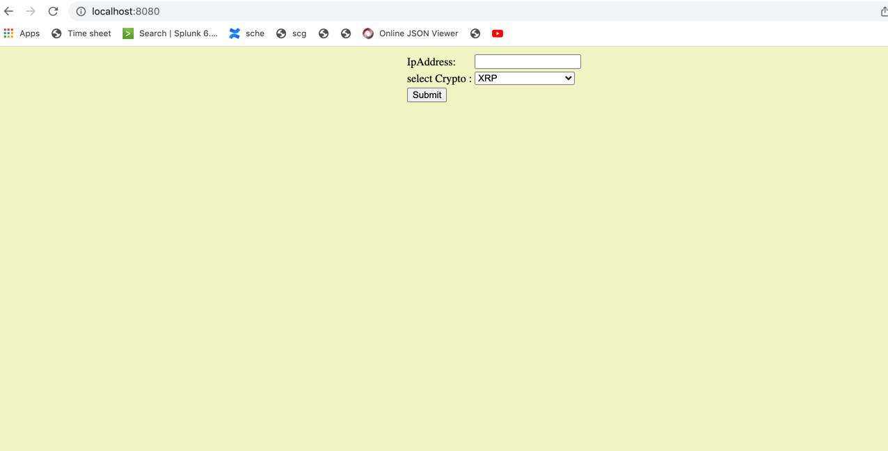
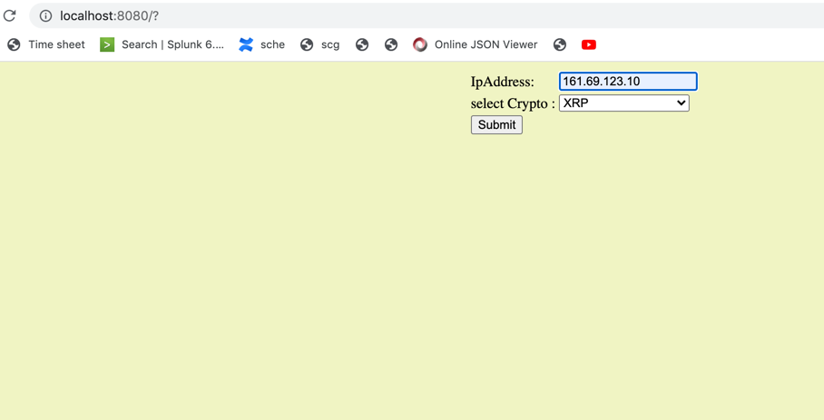
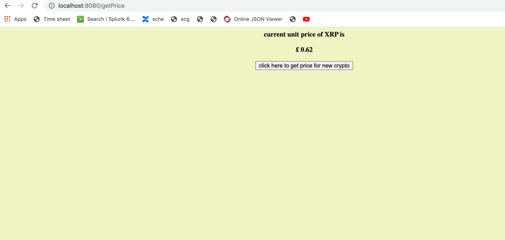
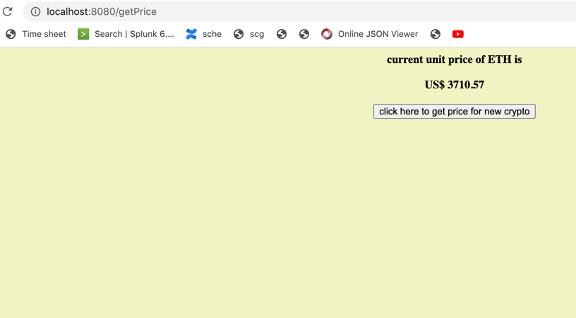

1.Repo Url : https://github.com/palamit21/crypto-price-service .
2.Pull Request URL: https://github.com/palamit21/crypto-price-service/pull/1 .
3.Commit History: https://github.com/palamit21/crypto-price-service/pull/1/commits .

**Below are the third party API. Which are being used to build the application**
1. **https://data.messari.io/api/v1/assets-> This third party API is being used to get the latest Crypto price.
2. **https://v6.exchangerate-api.com**-> This third party API is being used to get the latest currency conversion rate with respect to USD.
3. **http://api.ipstack.com/**-> This third party API is being used to get the locale of the country based on IP address.

Below are the few main maven dependency are used 
1. spring-boot-starter-thymeleaf -> Thymeleaf is used for creating HTML page and render the information in UI.
2. spring-cloud-starter-openfeign-> This dependency is used to communicate third party API.
3. lombok->It is used for few annotations.

**Logic to fetch the crypto price** 
Case 1-> when the IpAddress entered by user in input field.
Solution-> If IP is present in request the service will invoke the http://api.ipstack.com API, which will return the Locale of the Ipaddress post that all the other calculation is happening.

Case 2-> when the IpAddress input field is null.

Solution - If the input field is null service is pulling the Locale information from **HttpServletRequest** post that all the other calculation is happening. 

**Steps to run Application**
Checkout the develop branch 

Run the following command in a terminal window in the directory

  ./mvnw spring-boot:run

once the app is started hit the below url in browser
**http://localhost:8080/**
it will open the app landing page

Screenshot of Application :
Landing page screen

1. 

Result Screen

1. 
   
2. 

  